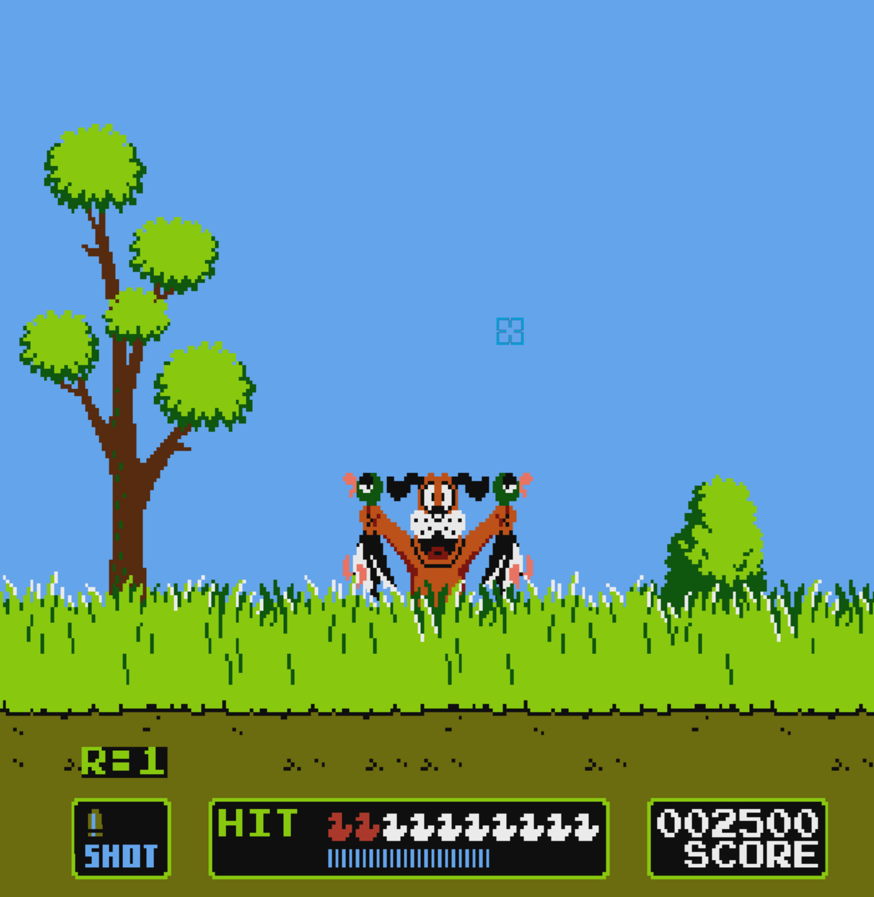

# Duck Hunt Remake

This is a remake of the 2-duck mode in NES classic Duck Hunt using C and OpenGL.

## How to play
 - Clone the project
 - Open the Game folder and launch the .exe
 - If using mouse controls, right click to start. If using a Wii remote via GlovePIE, make sure the GlovePIE window is selected, then left click to begin the game.

# Key features

## Object-Oriented Structure
 - Used vtables and callbacks to create an object-oriented structure

## Game Flow Management
 - Accurately mimics the scaling of duck speed and time per wave from the NES original
 - Player, wave, and round managers function to create a seamless game flow

## Sprite and Number Rendering
 - Designed systems to efficiently retrieve the proper sprites based on animation state/data values

This project was completed over the course of one month using advanced C programming techniques and OpenGL rendering.

All source code is available!
